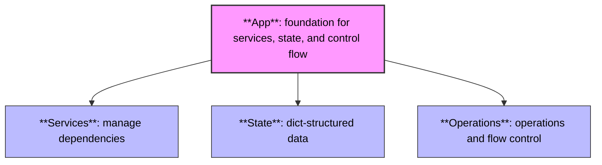
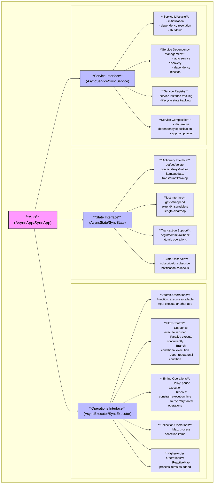

# Core Concepts

Here’s a look at what each core concept is and why it’s important in Loomi’s architecture:

**App**
- What: the foundament orchestrating State, Operations, and Services.
- Why: to provide a self-contained unit that groups state, control flow and dependencies.

**State**
- What: a dict-structured data store offering transactions and observers. 
- Why: to centralize data management for consistent, atomic updates and reactive change propagation.

**Operations**
- What: the operations engine defining composable tasks and flow controls. 
- Why: to express business logic declaratively and modularly, avoiding tangled imperative code.

**Services**
- What: lifecycle-managed external dependencies. 
- Why: to abstract and automate resource management, ensuring reliable setup and cleanup without manual boilerplate.



## Concepts Mindmap



## **Apps**: The Foundation

Loomi is built around a single, powerful building block: the App. 

Each App contains three core elements:

- **Services**: Managed external dependencies with proper lifecycles
- **State**: Tree-structured data storage with consistent access patterns
- **Operations**: Composable units of business logic 

This trinity of concepts provides a comprehensive foundation for building applications that remain manageable as they grow.

**Key features:**
- Explicit dependency declaration
- Automatic lifecycle management
- Nestable to create component hierarchies
- Owns its slice of state 
- Defines its logic in a declarative manner
- Testable in isolation

**Quick example:**
```python
class UserService(AsyncApp):
    # Services needed are right here at the top - no surprises
    database = UseService(DatabaseSpec(url="postgres://localhost/users"))
    email = UseService(EmailSpec(sender="noreply@example.com"))
    
    # Need authentication? Just nest the auth app
    auth = UseApp(AuthApp)
    
    async def create_user(self, context):
        """Create a new user and send welcome email."""
        # Validate credentials with nested app
        validated = await self.auth.validate_credentials(context["credentials"])
        
        # Save to database
        user_id = await self.database.insert("users", validated["user_data"])
        
        # Send welcome email
        await self.email.send_template("welcome", validated["email"])
        
        return {"user_id": user_id}
    
    def define(self) -> AsyncOperation:
        return self.ex.Function(self.create_user)
```

[Learn more about Apps →](/docs/learn/app)

## **Services**: Managed Dependencies

Remember that time you tracked down a mysterious connection leak only to find someone forgot to close a resource? 
Or when your app crashed because dependencies initialized in the wrong order?

Services in Loomi handle all that messy lifecycle stuff automatically:
- Resources get initialized in the right order
- Everything gets cleaned up properly on shutdown
- Errors during setup are handled gracefully

**Key features:**
- Automatic initialization and cleanup
- Dependency-aware startup/shutdown order
- Configurable through specs
- Smart instance reuse
- Clean error handling

**Quick example:**
```python
class CacheService(AsyncService):
    async def setup(self):
        """Loomi calls this automatically during startup."""
        self.client = await create_redis_client(
            self.spec.url,
            max_connections=self.spec.pool_size
        )
        self.logger.info(f"Connected to cache at {self.spec.url}")
        
    async def get(self, key):
        return await self.client.get(key)
        
    async def set(self, key, value, ttl=None):
        return await self.client.set(key, value, ttl)
        
    async def cleanup(self):
        """Loomi ensures this gets called, even after errors."""
        await self.client.close()
        self.logger.info("Cache connections closed")
```

[Learn more about Services →](/docs/learn/service)

## **State**: Tree-Structured Data That Just Works

State management is one of those things that starts simple and quickly spirals out of control. 
Where does data live? How is it accessed? What happens when multiple components need it?

Loomi's state system gives you a consistent approach that scales from trivial to complex:
- Structured as a tree of dictionaries and lists
- Access patterns that work at any level of nesting
- Transactions for when you need robust updates
- Reactive updates for when data changes

**Key features:**
- Consistent dict/list operations
- Path-based access for deep nesting
- Transactions for atomic updates
- Change notifications (reactivity)
- Works with both sync and async code

**Quick example:**
```python
async def transfer_points(self, from_id, to_id, amount):
    # Start a transaction - either both updates happen or neither does
    async with await self.state.transaction() as txn:
        # Access users with transaction context
        users = await self.state.dict("users", txn=txn)
        
        # Get current balances
        from_user = await users.dict(from_id)
        to_user = await users.dict(to_id)
        
        from_balance = await from_user.get("points", default=0)
        to_balance = await to_user.get("points", default=0)
        
        # Ensure sufficient balance
        if from_balance < amount:
            raise InsufficientPointsError(f"User only has {from_balance} points")
        
        # Update both - all or nothing
        await from_user.set("points", value=from_balance - amount)
        await to_user.set("points", value=to_balance + amount)
        
    # Transaction committed automatically if we get here
```

[Learn more about State →](/docs/learn/state)

## **Operations**: Logic You Can Actually Follow

We've all seen that function—you know, the one with six nested if-statements,
three try-except blocks, and a comment that just says "Here be dragons." 
Operations in Loomi give you a better way to express app's logic.

Instead of a tangled mess of function calls, you get composable building blocks that clearly express intention:
- Want to run things in sequence? Use `Sequence`
- Need to handle different cases? Use `Branch` 
- Processing a collection? Use `Map`

**Key features:**
- Basic operations (Function, App)
- Flow control (Sequence, Parallel, Branch, Loop)
- Timing patterns (Delay, Retry, Timeout)
- Collection processing (Map)
- Reactive operations (Subscribe)
- Error handling - built-in
- Cancellation and cleanup - built-in
- Logging and tracing - built-in

**Quick example:**
```python
def define(self) -> AsyncOperation:
    # This is practically pseudocode, but it actually works
    return self.ex.Sequence(
        # First, fetch the data
        self.ex.Function(self.load_data),
        
        # Then process it with retry and timeout protection
        self.ex.Retry(
            self.ex.Timeout(
                self.ex.Function(self.process_data),
                timeout=5.0,  # Don't hang forever
                on_timeout=self.ex.Function(self.handle_timeout)
            ),
            max_attempts=3,  # Sometimes APIs are flaky
            backoff_factor=2.0  # Be nice and back off exponentially
        ),
        
        # Finally, take different actions based on result
        self.ex.Branch({
            "success": self.ex.Function(self.handle_success),
            "failure": self.ex.Function(self.handle_failure),
            None: self.ex.Function(self.handle_unknown)  # Default case
        }, condition=self.check_result)
    )
```

[Learn more about Operations →](/docs/learn/operations)

## How It All Fits Together

Loomi's intrinsic design centers around the deep integration between operations and state. 

Operations can read from state paths to make decisions, write to state for other operations to consume, 
and automatically react to state changes without complex wiring. 

This creates a declarative, expressive paradigm where your data and logic collaborate naturally, making even complex workflows both powerful and readable.

Example: State directly controls your workflow branching

```python
self.ex.Branch(
    {
        "premium": self.ex.Function(self.premium_workflow),
        "basic": self.ex.Function(self.basic_workflow),
    },
    condition_path=("user", "subscription_type")  # State determines the path
)
```

Example: Process items as they're added to your state

```python
self.ex.Subscribe(
    self.ex.Function(self.process_todo),
    watch_path=("todos",),  # Automatically handles new todos
    max_concurrency=2
)
```
