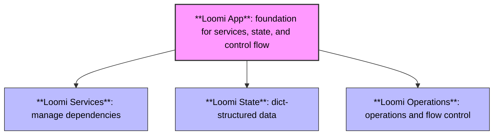

import { Steps } from 'nextra/components'

# Introduction 

Every Python developer's journey starts with simple scripts that gradually evolve into complex messes.
## When Good Scripts Go Bad 🔥
 
<Steps>

### Day 1: "Just a simple script!"

```python
def process_data():
    data = load_data()
    results = analyze(data)
    save_results(results)
```

### Day 3: "It works! Ship it!"

### Day 30: "Dear god, what have I created?"

```python
global_config = {}
_CACHE = {}
DB_CONNECTION = None
active_workers = []

def initialize_services():
    global DB_CONNECTION
    try:
        DB_CONNECTION = setup_database()
        # Remember to call shutdown_services() or we'll leak connections!
    except Exception as e:
        log.error(f"Failed to initialize: {e}")
        # Did we remember to clean up partial initialization?
```
*...and 2000 more lines of code that make you question your life choices.*

</Steps>

**Sound familiar? You're not alone. We've all been there.**

### The Stages of Python Pain

As your Python code grows, it hits these common problems:

- **Function Mess**: Too many loose functions that depend on each other in hidden ways
- **State Trouble**: Data that changes unexpectedly across your program
- **Threading Headaches**: Code that breaks only when running in parallel
- **Service Tangle**: Databases, APIs, and resources that fight with each other
- **Error Gaps**: Try/except blocks scattered randomly as afterthoughts

What if you could build Python apps that stay clean as they grow?

## Loomi in a Nutshell 🧩 

### What Loomi **IS**

Every Python application, from simple scripts to complex systems, juggles three core elements:

- **State**: How data flows through your application
- **Control Flow**: The instructions that transform data and create behavior
- **Services**: External dependencies from databases to APIs

As your codebase grows, managing these elements becomes increasingly complex.

Loomi is a new way to build Python applications that keeps these three elements in harmony.
It provides a unified system for managing state, control flow, and services in a way that scales with complexity while remaining simple and clear.



### What Loomi is **NOT**

Let's clear up some misconceptions:

- **Not a web framework** - It doesn't compete with Flask, FastAPI, or Django. In fact, Loomi apps can run inside those frameworks.
- **Not a workflow engine** - It's not Airflow or Prefect. While it has workflow features, Loomi is a paradigm for building applications, not scheduling distributed jobs.
- **Not a data processing library** - It doesn't replace Pandas or Spark. Loomi helps you structure the application that might use those tools.
- **Not an ORM** - It doesn't replace SQLAlchemy or Pydantic. Loomi gives structure to the app that might use those libraries.


### Demonstration

They say a good example is worth 100 pages of API documentation, a million directives, or a thousand words.

Well, "they" probably lie... but here's an example anyway:

> Don't worry about understanding everything yet—notice how the architecture makes the code's intent clear.

```python
from loomi import AsyncApp, AsyncContext, AsyncOperation, Spec, UseApp, UseService

# ------------------------------------------------------
# Define services
# ------------------------------------------------------
class ImageStorageService(AsyncService):
    async def load_image(self, filename): pass
    async def save_image(self, filename, data): pass

class AnalysisService(AsyncService):
    async def analyze_image(self, image_data): pass


# ------------------------------------------------------
# Image Filter App
# ------------------------------------------------------
class ImageProcessorApp(AsyncApp):
    # Service dependencies
    analysis: AnalysisService = UseService()
    storage: ImageStorageService = UseService()
    
    # Define the execution logic
    def define(self) -> AsyncOperation:
        return self.ex.Sequence(
            # Step 1: Set up initial state
            self.ex.Function(self.init_state),
            
            # Step 2: Analyze image and store result in state 
            self.ex.Function(self.analyze_image),
            
            # Step 3: Branch based on state value
            self.ex.Branch(
                {
                    # Different processing paths based on analysis
                    "dark": self.ex.Sequence(
                        # For dark images, apply two filters
                        self.ex.Function(self.apply_brightness_correction),
                        self.ex.Function(self.apply_sharpening)
                    ),
                    "bright": self.ex.Function(self.apply_contrast_reduction),
                    "normal": self.ex.Function(self.apply_standard_enhancement)
                },
                # Use path in state to determine branch
                condition_path=("analysis", "brightness_category")
            ),
            
            # Step 4: Iterative enhancement with loop based on state condition
            self.ex.Loop(
                # Process to run in each iteration
                self.ex.Function(self.enhance_quality),
                
                # Continue loop while this condition is true
                condition_path=("analysis", "quality_met")
            ),
            
            # Step 5: Save result
            self.ex.Function(self.save_result)
        )
    
    # Method implementations...
    async def apply_brightness_correction(self, ctx): pass
    async def apply_sharpening(self, ctx): pass
    async def apply_contrast_reduction(self, ctx): pass
    async def apply_standard_enhancement(self, ctx): pass
    async def enhance_quality(self, ctx): pass
    async def save_result(self, ctx): pass


# ------------------------------------------------------
# Main Processor App
# ------------------------------------------------------
class ImageProcessingPipeline(AsyncApp):
    # Dependencies
    storage: ImageStorageService = UseService()
    filter_app: ImageProcessorApp = UseApp()
    
    # Define the execution logic
    def define(self) -> AsyncOperation:
        return self.ex.Sequence(
            # Step 1: Initialize state with image list
            self.ex.Function(self.initialize_pipeline_state),
            
            # Step 2: Process all images in parallel with Map
            self.ex.Map(
                # For each image...
                self.ex.Sequence(
                    # Load the image
                    self.ex.Function(self.load_image),
                    
                    # Process with isolated state scope
                    self.ex.App(
                        self.filter_processor,
                        # Each image gets its own state path
                        state_path=("processing", "$map_path")
                    ),
                    
                    # Collect results
                    self.ex.Function(self.update_progress)
                ),
                # Source items from state path
                items_path=("images"),
                # Concurrency limit
                max_concurrency=3,
                # Error handling
                error_behavior="continue",
                on_fail=self.ex.Function(self.log_error)
            ),
            
            # Step 3: Generate report
            self.ex.Function(self.generate_report)
        )
    
    # Method implementations ...
    async def initialize_pipeline_state(self, filenames): pass
    async def load_image(self, ctx): pass
    async def update_progress(self, ctx): pass
    async def log_error(self, ctx): pass
    async def generate_report(self, ctx): pass
```