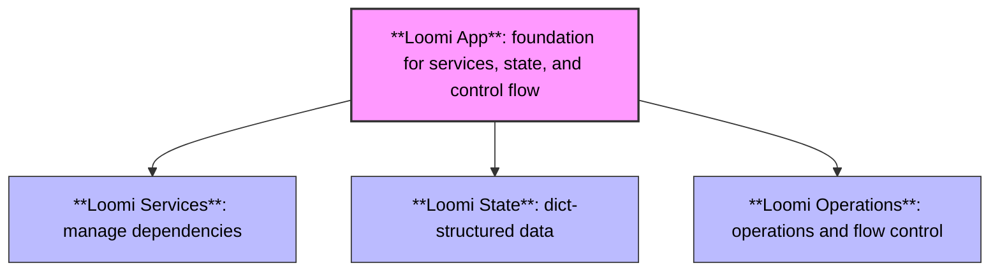

import { Steps } from 'nextra/components'

# Introduction 

## When Good Scripts Go Bad

Every Python developer's journey starts with simple scripts that gradually evolve into complex messes.
 
<Steps>

### Day 1: "Just a simple script!"

```python
def process_data():
    data = load_data()
    results = analyze(data)
    save_results(results)
```

### Day 3: "It works! Ship it!"

### Day 30: "Dear god, what have I created?"

```python
global_config = {}
_CACHE = {}
DB_CONNECTION = None
active_workers = []

def initialize_services():
    global DB_CONNECTION
    try:
        DB_CONNECTION = setup_database()
        # Remember to call shutdown_services() or we'll leak connections!
    except Exception as e:
        log.error(f"Failed to initialize: {e}")
        # Did we remember to clean up partial initialization?
```
*...and 2000 more lines of code that make you question your life choices.*

</Steps>

**Sound familiar? You're not alone. We've all been there.**

### The Stages of Python Pain

As your Python code grows, it hits these common problems:

- **Function Mess**: Too many loose functions that depend on each other in hidden ways
- **State Trouble**: Data that changes unexpectedly across your program
- **Threading Headaches**: Code that breaks only when running in parallel
- **Service Tangle**: Databases, APIs, and resources that fight with each other
- **Error Gaps**: Try/except blocks scattered randomly as afterthoughts

What if you could build Python apps that stay clean as they grow?

## Loomi: The Upgrade

They say a good example is worth 100 pages of API documentation, a million directives, or a thousand words.

Well, "they" probably lie... but here's an example anyway:

> Don't worry about understanding everything yet—this is just to show you what Loomi can do.

```python
"""
This example demonstrates how to implement a simple priority-based task processing system.
It initializes 2 queues: one for high-priority tasks and another for low-priority.
Tasks are processed in order of priority, with high-priority tasks being processed first.
"""

import asyncio
from pathlib import Path

# Loomi imports
from loomi import AsyncApp, Context, Operation, Spec
from loomistd.aexecutor import ExecutionEngineSpec
from loomistd.aexecutor.services.tracing import TracingServiceSpec
from loomistd.kv.file_storage import FileStorageSpec
from loomistd.state import StateSpec

# Basic state configuration
state_spec = StateSpec()
trasing_spec = TracingServiceSpec(
    tracing_state=StateSpec(storage_srv=FileStorageSpec(path=Path(".tracing/db")))
)
executor_spec = ExecutionEngineSpec(state=state_spec, tracing=trasing_spec)


class PriorityTaskApp(AsyncApp):
    """Demonstrates priority-based task processing with Loomi."""

    def define(self) -> Operation:
        """Define priority-based processing."""
        return self.ex.Sequence(
            # Initialize priority queues
            self.ex.Function(self.init_state),
            # Loop through tasks until all are processed
            self.ex.Loop(
                # Process tasks in priority order
                self.ex.Branch(
                    {
                        # When high priority tasks exist, process those first
                        True: self.ex.Map(
                            self.ex.Function(self.process_high_priority_task),
                            items_path=("_", "tasks", "high_priority"),
                            max_concurrency=5,
                        ),
                        # Otherwise process low priority tasks
                        False: self.ex.Map(
                            self.ex.Function(self.process_low_priority_task),
                            items_path=("_", "tasks", "low_priority"),
                            max_concurrency=5,
                        ),
                    },
                    condition=self.has_high_priority_tasks,
                ),
                condition=self.has_tasks,
            ),
        )
    
    async def init_state(self, context: Context):
        """Initialize state with priority queues."""
        context.scope.set(
            "tasks",
            value={  # Initialize task storages with some dummy tasks
                "high_priority": {"task1": {"description": "Critical system update"}},
                "low_priority": {"task2": {"description": "Cleanup old logs"}},
            },
        )
        context.scope.set("results", value={})  # Initialize results storage

    async def process_high_priority_task(self, context: Context):
        """Process a high-priority task."""
        task_id = context["map_key"]
        print(f"Processing HIGH priority task: {task_id}")

        # Move task from high_priority queue to results
        context.scope.dict("tasks", "high_priority", task_id).move_to("_", "results", task_id)

    async def process_low_priority_task(self, context: Context):
        """Process a low-priority task."""
        task_id = context["map_key"]
        print(f"Processing LOW priority task: {task_id}")

        # Move task from low_priority queue to results
        context.scope.dict("tasks", "low_priority", task_id).move_to("_", "results", task_id)

    async def has_high_priority_tasks(self, context: Context) -> bool:
        """Check if high-priority tasks exist."""
        return bool(context.scope.dict("tasks", "high_priority").keys())

    async def has_tasks(self, context: Context) -> bool:
        """Check if high-priority tasks exist."""
        return bool(
            context.scope.dict("tasks", "high_priority").keys()
            or context.scope.dict("tasks", "low_priority").keys()
        )


async def main():
    """Run the priority task processing example."""
    print("\nStarting priority-based task processing example\n")

    # Create and run the application
    async with PriorityTaskApp(
        Spec(factory=PriorityTaskApp),
        state_spec=state_spec,
        executor_spec=executor_spec,
    ) as app:
        # Start the app
        await app.start()

    print("\nPriority-based task processing example completed\n")


if __name__ == "__main__":
    asyncio.run(main())

```

### What Loomi **IS**

Every Python application, from simple scripts to complex systems, has three core elements:

- **State**: How data flows through your application
- **Control Flow**: The instructions that transform data and create behavior
- **Services**: External dependencies from databases to APIs

As your codebase grows, managing these elements becomes increasingly complex.

Loomi is a new way to build Python applications that keeps these three elements in harmony.
It provides a unified system for managing state, control flow, and services in a way that scales with complexity while remaining simple and clear.



### What Loomi is **NOT**

Let's clear up some misconceptions:

- **Not a web framework** - It doesn't compete with Flask, FastAPI, or Django. In fact, Loomi apps can run inside those frameworks.
- **Not a workflow engine** - It's not Airflow or Prefect. While it has workflow features, Loomi is a paradigm for building applications, not scheduling distributed jobs.
- **Not a data processing library** - It doesn't replace Pandas or Spark. Loomi helps you structure the application that might use those tools.
- **Not an ORM** - It doesn't replace SQLAlchemy or Pydantic. Loomi gives structure to the app that might use those libraries.
